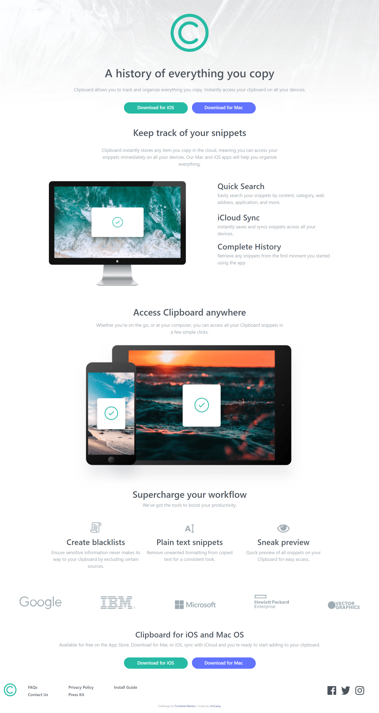

# Frontend Mentor - Clipboard landing page solution

This is a solution to the [Clipboard landing page challenge on Frontend Mentor](https://www.frontendmentor.io/challenges/clipboard-landing-page-5cc9bccd6c4c91111378ecb9). Frontend Mentor challenges help you improve your coding skills by building realistic projects. 

## Table of contents

- [Overview](#overview)
  - [The challenge](#the-challenge)
  - [Screenshot](#screenshot)
  - [Links](#links)
- [My process](#my-process)
  - [Built with](#built-with)
  - [What I learned](#what-i-learned)
  - [Continued development](#continued-development)
- [Author](#author)
- [Acknowledgments](#acknowledgments)

**Note: Delete this note and update the table of contents based on what sections you keep.**

## Overview

### The challenge

Users should be able to:

- View the optimal layout for the site depending on their device's screen size
- See hover states for all interactive elements on the page

### Screenshot

### Links

- Solution URL: [Solution](https://github.com/JimCarey08/clipboard-landing-page/)
- Live Site URL: [live site ](https://jimcarey08.github.io/clipboard-landing-page/)

## My process

### Built with

- Semantic HTML5 markup
- CSS custom properties
- Flexbox
- CSS Grid
- Mobile-first workflow
- [Bootstrap](https://getbootstrap.com) CSS FrameWork

### What I learned

I put on practice bootstrap grid and propreties in general, learned that mobile-firts is a lot easier to deal with and that was my first junior level project of front-end mentor :)

### Continued development

definitively i need to improve the combining of bootstrap and css custom to get betters results, so learn about specificity...

## Author

- Frontend Mentor - [@JimCarey08](https://www.frontendmentor.io/profile/JimCarey08)
- Twitter - [@LucasViCoisas](https://www.twitter.com/LucasViCoisas)

## Acknowledgments

consistency is the key!
